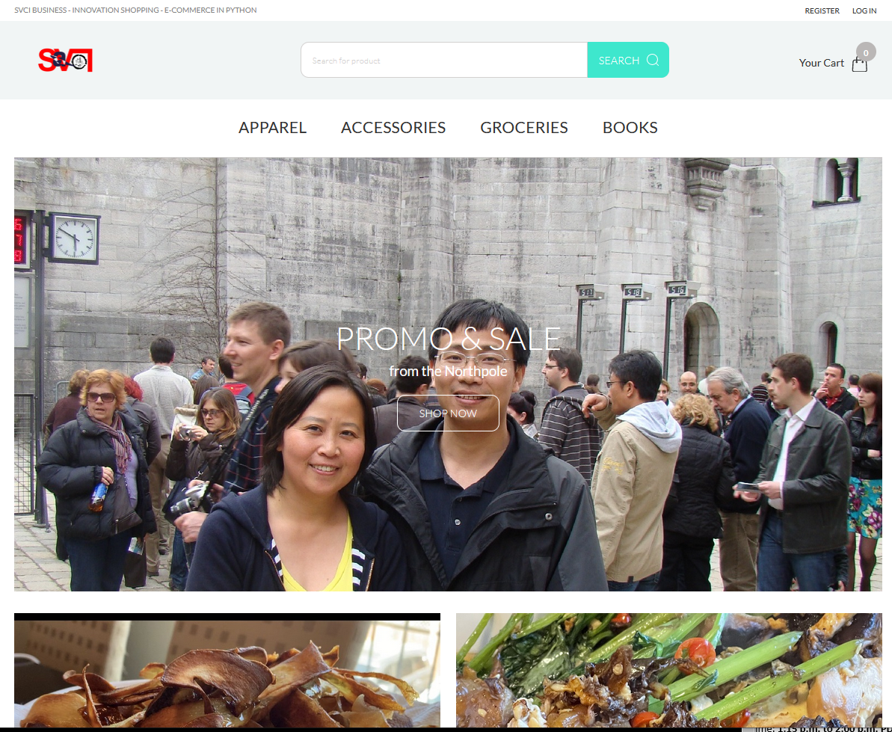
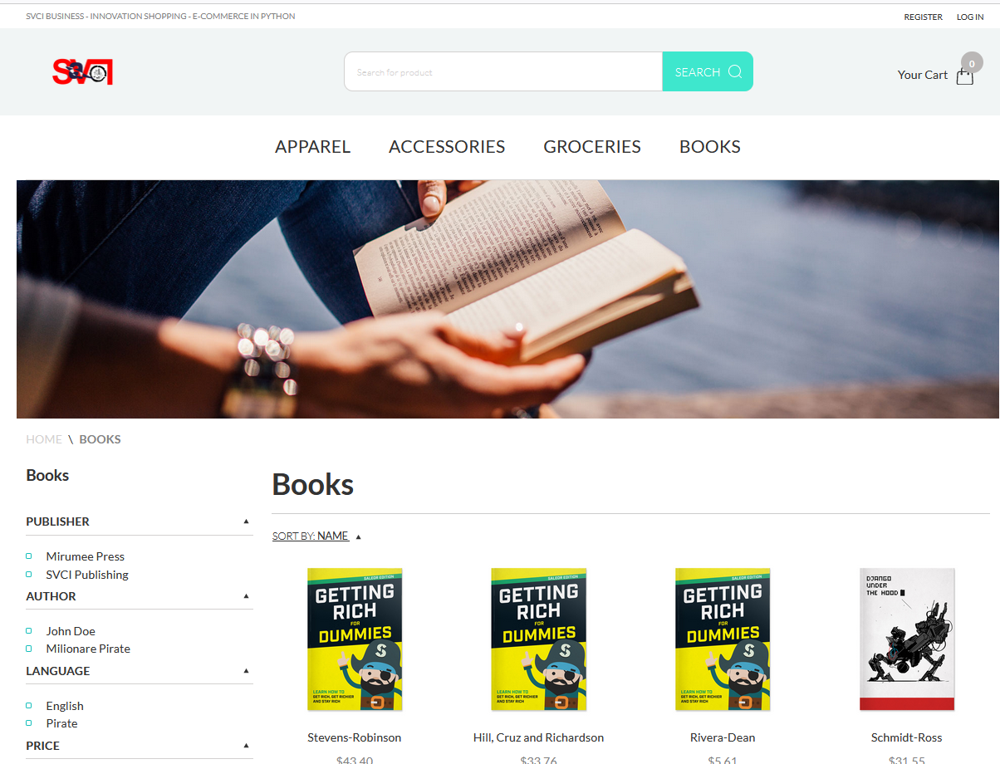
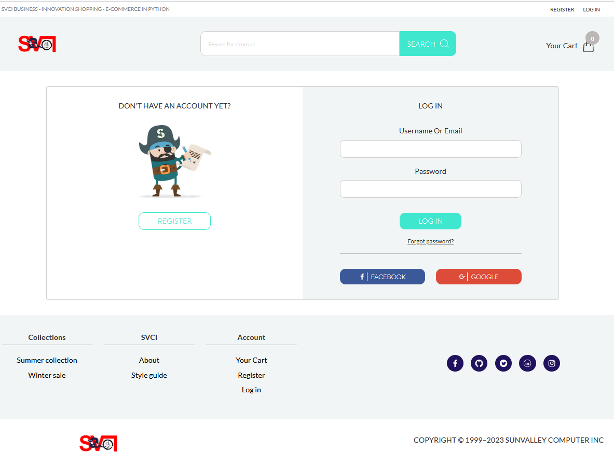
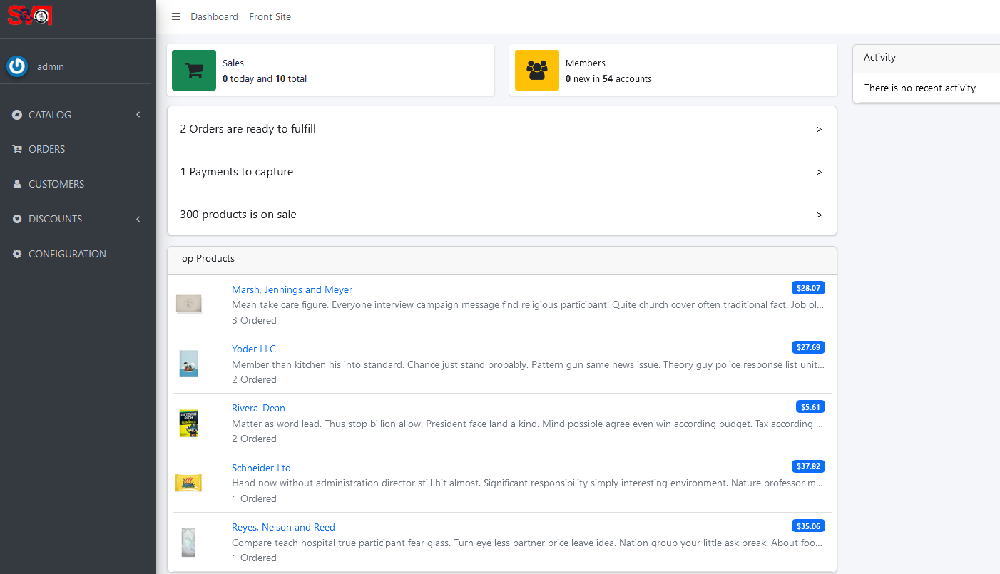
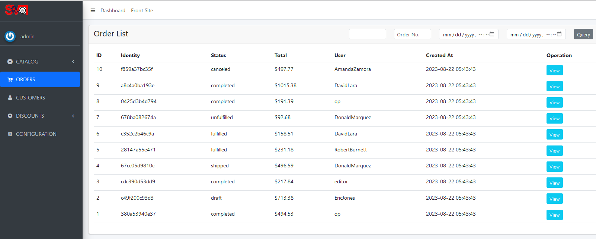
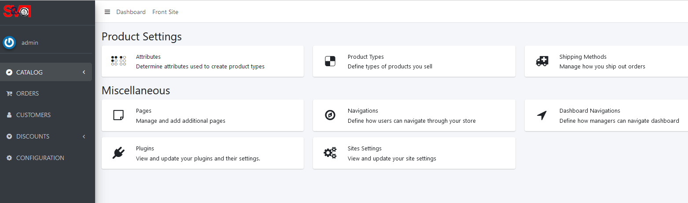

# SVCI Business - An Amazing Project

## Introduction
This project is a web page copy of svci project, but written with Python.

## ScreenShot

<table align="center">
    <tr>
        <td align="center">
            
        </td>
        <td align="center">
            
        </td>
        <td align="center">
            
        </td>
    </tr>
    <tr>
        <td align="center">
            
        </td>
        <td align="center">
            
        </td>
        <td align="center">
            
        </td>
    </tr>
</table>

## Feature

* large SVCI project structure, easy to extend and secondary develop
* always update and use newest packages, python features
* multi language and locallization support
* product ready, good performance

